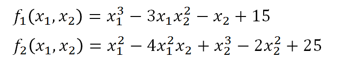
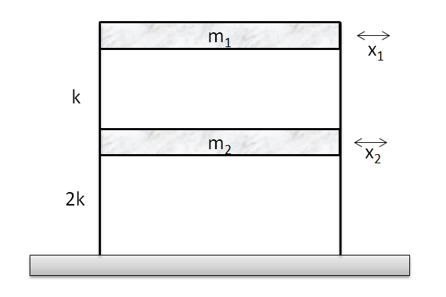
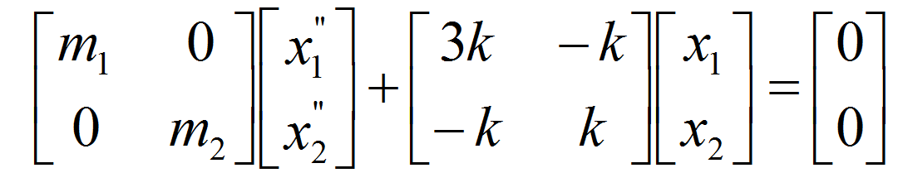
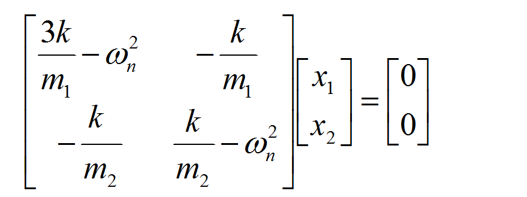

# Midterm 2 MENG602/438
Date: April 30th 2020
Time: 5:45pm - 11:45pm

## Student's information
 
<form id="percentageBiz" method="post">
<input type="text" id="name" placeholder = "Name">
<input type="text" id="nyitid" placeholder = "NYIT ID">
<input type="submit" onclick="return getp()" value="Generate Parameters"> 
</form>
 
The question is for student: 

 

## Problem 1 
A set of simultaneous linear algebraic equations results: **A** x **c** = **b** 

**A** = [ 
 
]
 
**b** = []T
 

(i)	Find the inverse matrix **A-1**. 
(ii)	Find Euclidean norm of **A** and **A-1** 
(iii)	Calculate matrix condition number using Euclidean norms, and aslo determine how many suspect digits would be needed by solving this system for minimizing roundoff errors. 

## Problem 2 
Determine the solution of the simultaneous nonlinear equations 

Use Newton-Raphson method and employ initial guesses of  
_**x1**_ =  

_**x2**_ =  

(i) Write and calculate Jacobian matrix.  
(ii) Calculate x1 and x2 after first iteration and calculate _f1_ and _f2_ with updated x1, x2. 
(iii) Calcualte error of approximation (ea).  

## Problem 3
Application of Eigenvalues and Eigenvectors

Consider the mass spring model to gain insight into the dynamics of structures under the influence of disturbances such as earthquakes.
Above figure shows such a model for a two-stroy building. Each floor mass is represented by mi, and each floor stiffness is represented by k.  
The frequencies for the mass vibrations can be determined by solving for the eigenvalues and by applying _MX"_ + _kX_ = 0, which yields

Applying the guess **x = x0eiωnt** as a solution, we get the following matrix:

where xi represent horizontal floor displacement, and ωn is the natural, or resonant, frequency (radians/s).

Let **_m1_** = **_m2_** =  (Kg) 
and _**k**_ =  (N/m) 

(i) Use eigenvalues to solve for freqencies. 
(ii) If m1 floors is unknown, based on the observation, the frequency is 0.1, what is possible m1. 
(iii) Describe your approach to find m1 by iteration method.  

<input type="submit" onclick="window.print()" value="Print">
## Submission
Use above print bottom to save your exam sheet to pdf and upload with your solution to **Midterm2 Submission Box** in class's blackboard. Please submit your solution before 11:45pm April 30th 2020. 

### Notice
If the the values and euqations don't match to your problem sheet, no credit will be given for this exam. 
This is an openbook exam, any tool, program, or online resource are allowed in the exam. 
 

<input type="text" id="pw1" placeholder="access code">
<input type="submit" onclick="return runsol()" value="Generate Solution">

 

